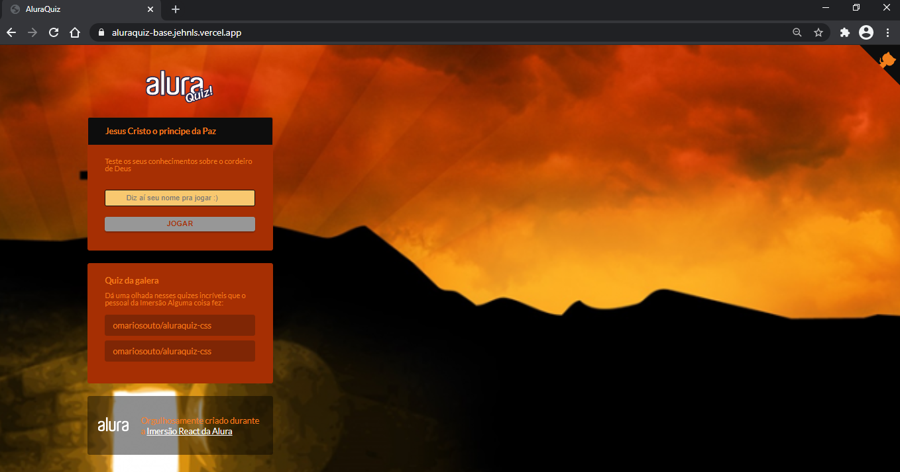

<h1 align="center">
  
</h1>

<h4 align="center">
  AluraQuiz
</h4>
<p align="center">

  

<p align="center">
  <a href="#octocat-roadmap">Roadmap</a>&nbsp;&nbsp;&nbsp;|&nbsp;&nbsp;&nbsp;
   <a href="#rocket-technologies">Technologies</a>&nbsp;&nbsp;&nbsp;|&nbsp;&nbsp;&nbsp;
    <a href="#label-layout">Layout</a>&nbsp;&nbsp;&nbsp;|&nbsp;&nbsp;&nbsp;
  <a href="#computer-project">Project</a>&nbsp;&nbsp;&nbsp;|&nbsp;&nbsp;&nbsp;
  <a href="#runner-how-to-run">How to run</a>&nbsp;&nbsp;&nbsp;|&nbsp;&nbsp;&nbsp;
  <a href="#-how-to-contribute">How to contribute</a>&nbsp;&nbsp;&nbsp;|&nbsp;&nbsp;&nbsp;
  <a href="#memo-license">License</a>
</p>

<br>

<p align="center">
  ###In browser
 
  
   ###In mobile
  
  
</p>

## :octocat: Roadmap

- Day 1: React, Styled Components e Next.js - :heavy_check_mark:
- Day 2: Linter, Rotas e State - :heavy_check_mark:
- Day 3: Inputs e página de Quiz - :heavy_check_mark:
- Day 4: Quiz, Pontuação e Integrações com Next.js - :heavy_check_mark:
- Day 5: Páginas dinâmicas, animações e Lottie - :heavy_check_mark:

## :rocket: Technologies

This project was developed with the following techs:

- [React](https://reactjs.org/)
- [Next js](https://nextjs.org/)
- [Vercel](https://vercel.com/home?utm_source=next-site&utm_medium=banner&utm_campaign=next-website)
- [Styled-components](https://styled-components.com/)
- [Framer Motion](https://www.framer.com/motion/)


## :label: Layout

Access project layout [here](https://aluraquiz-base.jehnls.vercel.app/)

## :computer: Project

AluraQuiz is project with questions and answer (Quiz), with result at the end, it your theme is christian.

## :runner: How to run

### PageFrontEnd
Install the dependencies in folder ./
```
  $ yarn install

```

After that start the server
```
  $ yarn Dev

```
Access the link

- [localhost:3000](https://localhost:3000)


## 🤔 How to contribute

- Fork this repo;
- Create a branch for your new feature: `git checkout -b my-feature`;
- Commit your changes: `git commit -m 'feat: My brand new feature'`;
- Push it to your branch: `git push origin my-feature`.

After merge of your pull request, you can delete your branch.

## :memo: License

This project is under MIT license. See the file [LICENSE](LICENSE) for details.

---
